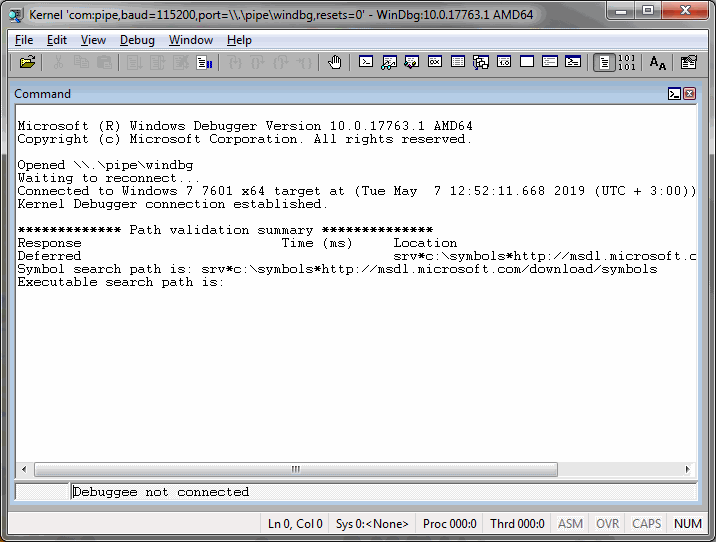
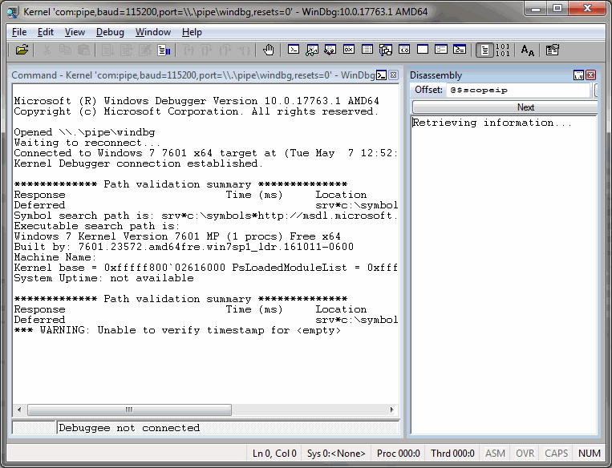
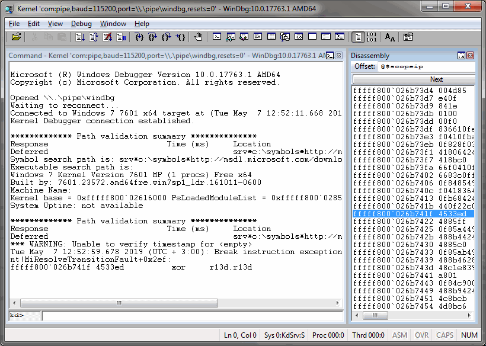
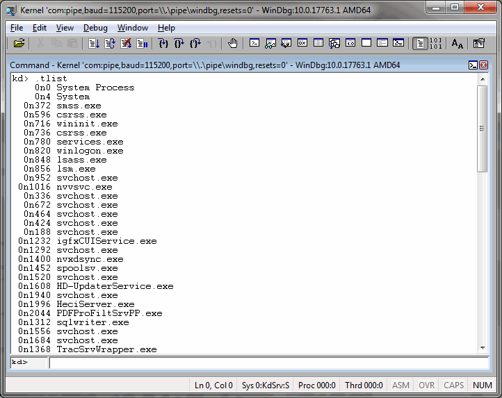
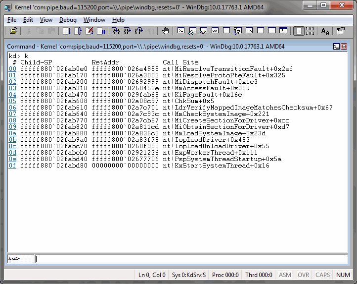
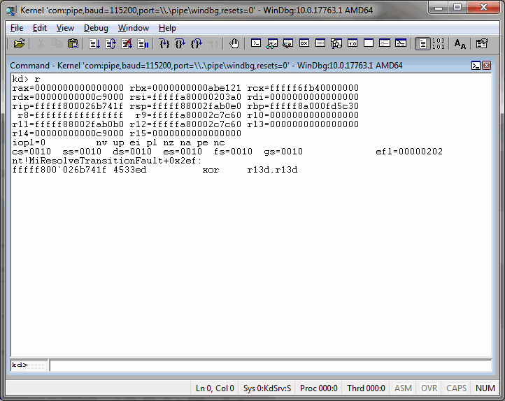
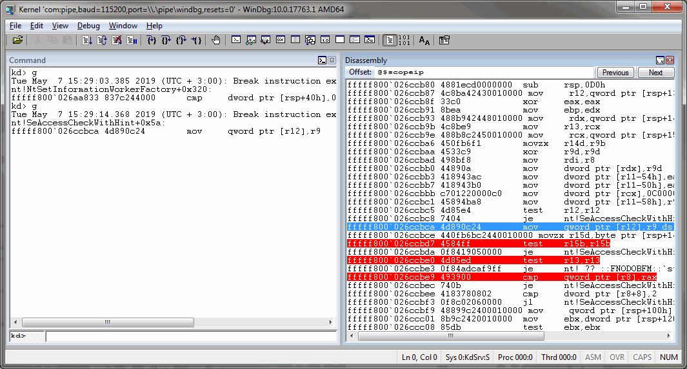
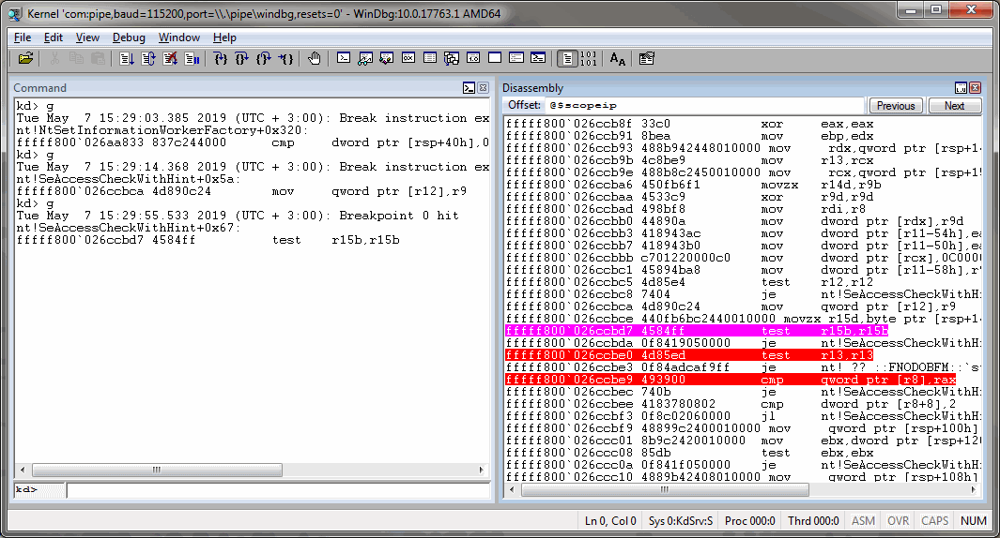
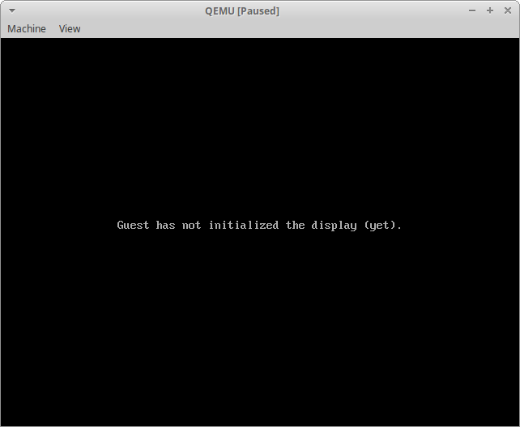
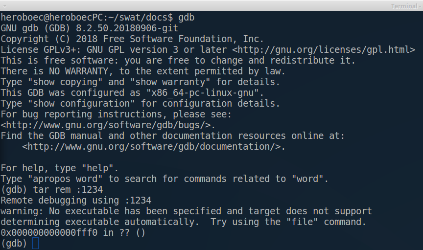

## QEMU GUI

SWAT includes GUI for managing QEMU virtual machines.

### Create virtual machine

To create VM use button "Create machine". No has sense do it before adding qemu folders, because fields "Platform", "Machine" and "CPU" fill automatically during it.

The window "Create Virtual Machine" contains four parameters group: 
- "OS information"

    Is necessary to fill field "Name" and if you want you can change default path to VM.
    
    Fields "OS type" and "OS version" don't use now.
- "System information"

    Values of this fields had got from current qemu, you have to choose what you need.
- "Memory size"
- "Disk"
    - No disk
    - Select exist disk
    - Create new disk

 
    
### Edit VM settings

Available devices present as a tree in the left on the form. Right click on nodes let you add new devices.

Some devices have a set of options, which you can change. It include select values from lists, set values, add additional options to command line.

There is a line for additional command line common qemu parameters on the bottom, if is necessary set specific options.

 

#### Specific command line options example

Enable logfiles

`
-D logfile -d in_asm
`

Use specific boot option

`
-kernel kernel-qemu-4.4.34-jessie
`

If you make changes, all record/replay execution will be deleted, because set of devices influence on executions and they will not work.

### Record/Replay

Qemu-gui allows record executions and replay it. Execution is a scenario of work system inside qemu. Execution includes all user and network interaction, interrupts, timers and other. You can replay one scenario many times and make analysis if you need.

All existing executions for VM are showing on the tab "Record/Replay".

Execution may be replayed only from the qemu with which it was recorded.

You can set icount value and enable/disable autosnapshot function. Autospapshot needs value of period in second.

 

## WinDbg server

SWAT supports debugging with WinDbg without switching the guest OS to the
debug mode.

### Startup:
Run qemu and windbg, and wait:




Now, press 'ctrl+break' and wait stopping:




### View process list:


### View call stack:


### View registers:


### Breakpoints:
Set breakpoints and press 'go':



## Reverse debugging

Reverse debugging allows "executing" the program in reverse direction.


### Case #1: Use recorded executions for save and replay behavior of the operating system.
    - Guest operating system: Debian x86_64
    - Path to guest operating system image: ~/imgs/debian_x86_64.qcow2
    - Path to qemu binary file: ~/qemu/x86_64-softmmu/qemu-system-x86_64
    - Memory size for guest operating system: 2G
    - Journal filename: replay.bin
    - Start snapshot name: init_snapshot

Record command:  
`~/qemu/x86_64-softmmu/qemu-system-x86_64   
-drive file=~/imgs/debian_x86_64.qcow,if=none,id=drv   
-drive driver=blkreplay,if=none,image=drv,id=drv_replay   
-device ide-hd,drive=drv_replay   
-m 2G    
-icount shift=5,rr=record,rrfile=replay.bin,rrsnapshot=init_snapshot`

Replay command:  
`~/qemu/x86_64-softmmu/qemu-system-x86_64   
-drive file=~/imgs/debian_x86_64.qcow,if=none,id=drv   
-drive driver=blkreplay,if=none,image=drv,id=drv_replay   
-device ide-hd,drive=drv_replay   
-m 2G    
-icount shift=5,rr=replay,rrfile=replay.bin,rrsnapshot=init_snapshot`

### Case #2: Use recorded executions and reverse debugging for undesired behavior investigation.

Start simulator and gdb server for interaction with GDB:  
`~/qemu/x86_64-softmmu/qemu-system-x86_64   
-drive file=~/imgs/debian_x86_64.qcow,if=none,id=drv   
-drive driver=blkreplay,if=none,image=drv,id=drv_replay   
-device ide-hd,drive=drv_replay   
-m 2G    
-S
-s
-icount shift=5,rr=replay,rrfile=replay.bin,rrsnapshot=init_snapshot`

After executing the command, the simulator will be launched in the mode, waiting for the debugger connection.




After that, the debugger should be running and connect to the simulator:   
`gdb -ex 'target remote :1234'`   



Breakpoint to address or to func name (if you have symbolic information) can be set now. For example the address in which the undesirable behavior appears equal 0x000000007fe61fe9. Set breakpoint and go forward:   
`b *(void*)0x7fe61fe9`  
`c`   
Simulator will pass to the breakpoint and stop. Now if you need to move to one step backward to examine the state of the system (x /20i $pc OR disas $pc, $pc+20), you can use the reverse-stepi command inside GNU debugger console:   
`reverse-stepi`   

If you want need to move to several steps backward (for example 10 steps), the reverse-roll command should be used:   
`reverse-roll 10`   

In most cases you don't know exactly count of commands should be stepped in backward direction. In this situatioun the reverse-continue command should be used. But first of all you must set a watch point to intrested data. After that run reverse-continue into gdb console:   
`reverse-continue`   
After that the simulator will stop its execution at the point of the last data change.

## QEMU Plugins

SWAT includes QEMU which was extended to support instrumentation and introspection plugins.

Our instrumentation subsystem exploits TCG helper mechanism to embed
callbacks into the translation blocks. These callbacks may be inserted
before the specific instructions.

### System call logging plugin example

```
#include <stdint.h>
#include <stdio.h>
#include "plugins.h"
#include "regnum.h"

bool plugin_init(const char *args)
{
    return true;
}

bool plugin_needs_before_insn(uint64_t pc, void *cpu)
{
    uint8_t code = 0;
    if (!qemulib_read_memory(cpu, pc, &code, 1)
        && code == 0x0f) {
        if (qemulib_read_memory(cpu, pc + 1, &code, 1)) {
            return false;
        }
        if (code == 0x34) {
            /* sysenter */
            return true;
        }
        if (code == 0x35) {
            /* sysexit */
            return true;
        }
    }
    return false;
}

void plugin_before_insn(uint64_t pc, void *cpu)
{
    uint8_t code = 0;
    uint32_t reg;
    qemulib_read_memory(cpu, pc + 1, &code, 1);
    /* Read EAX. There should be a header with register ids
       or a function for reading the register by the name */
    qemulib_read_register(cpu, (uint8_t*)&reg, I386_EAX_REGNUM);
    /* log system calls */
    if (code == 0x34) {
        qemulib_log("sysenter %x\n", reg);
    } else if (code == 0x35) {
        qemulib_log("sysexit %x\n", reg);
    }
}
```

## Virtual machine introspection

SWAT supports non-intrusive introspection of the virtual machine with the help of the dynamically loaded plugins.

Non-intrusiveness infers the following features:
* No need in loading any agents into the guest system
* Analysis and introspection can work when execution is replayed

SWAT can trace all API calls within the system.

It currently supports Windows XP and Linux (all possible versions) on i386.

Running API tracing:

    # SWAT installation directory
    dir=/usr/local
    # Run API tracing for Windows XP
    $dir/bin/qemu-system-i386 -D api.log -plugin $dir/lib/libintrospection.so,args="WinXP" -snapshot -hda WinXP.qcow2
    # Run API tracing for Linux
    $dir/bin/qemu-system-i386 -D api.log -plugin $dir/lib/libintrospection.so,args="Linux" -snapshot -hda Linux.qcow2

Execution log is saved into the file api.log. It includes list of the executed system call id's and the list of the executed named functions.

Linux log example:
```
Function b75cee10:__getpid
Function b758ecf0:calloc
Function b75cee10:__getpid
Function b75cee10:__getpid
Function b7592840:strdup
Function b758e300:malloc
Function b758e950:free
Function b76fcc30:__udivdi3
Function b76fcd60:__umoddi3
Function b76138d0:__snprintf_chk
Function b7613900:__vsnprintf_chk
Function b7588710:_IO_setb
Function b755cd30:vfprintf
Function b7596960:strchrnul
Function b7588840:_IO_default_xsputn
Function b7588840:_IO_default_xsputn
```

Windows log example:
```
5633000: sysenter c8
Function 75b44421:CsrValidateMessageBuffer
Function 75b43fc3:CsrQueryApiPort
54ae000: sysenter 1208
54ae000: sysenter 11de
Function 75b45520:CsrDereferenceThread
```
